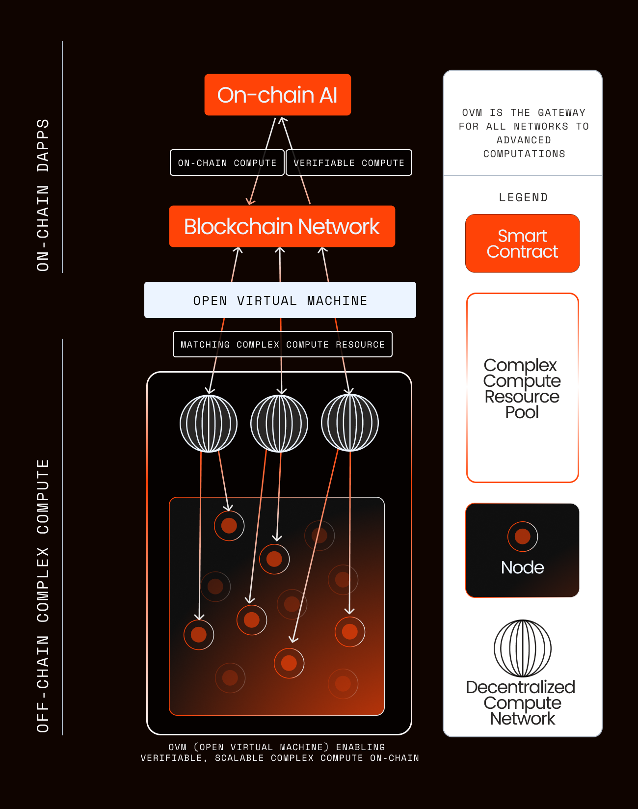

## Introduction

Open Virtual Machine, or OVM, is a high-performance, scalable, and secure virtual machine that is designed to run together with the Open Chain.

Developers can publish [tasks](./task) that leverage the OVM to execute complex computations like AI training, scientific simulations, or any other compute-intensive tasks that are not feasible on an EVM blockchain.

Developers can also create applications that execute multiple tasks to achieve even more complex computations.

Each task contract can be invoked by any user, and the user pays a fee to execute the task contract in qualified execution environments, known as the [Executor](./executor).
The author of each task retains a portion of the fees paid by the users of the task, which is known as the royalty fee, as specified in each task contract.

Tasks are routed by an on-chain gateway contract, which ensures that the task is executed by qualified execution environments that meet the requirements specified in the task contract.

The task execution results are recorded on-chain to offer verifiability and transparency.

## Features

### High Performance Compute (HPC)

OVM sources compute from decentralized and verifiable sources, such as Open Nodes, 

### Interoperability

OVM is EVM-compatible, which means that it supports native execution of Solidity smart contracts.

In fact, it interoperates with any blockchains, EVM or not.

### Language-agnostism

OVM employs state-of-the-art virtualization technology, meaning that it can execute any program written in any language.

### Trusted Execution Environment (TEE)

OVM is equipped with a Trusted Execution Environment (TEE), which ensures that the execution environment is secure and tamper-proof.

Sensitive data and operations are executed within the TEE, ensuring that secrets are never exposed to the external risks.

To begin development with OVM, visit:

<Card title="OVM Task" href="/guide/openchain/ovm/task"/>
