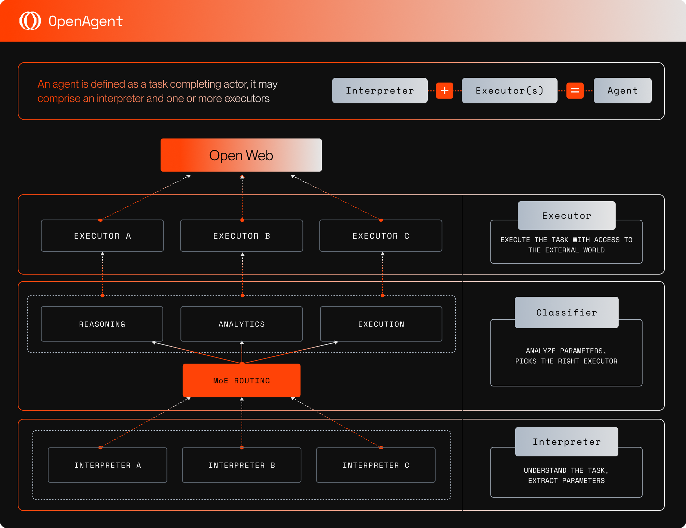

> The framework drastically shortens the development of functional AI Agents from months to hours, enabling developers to focus on the core logic of their applications, and leverage the power of OVM verifiable compute for secure and trustless execution.

## Introduction

This guide will dive into the architecture of OpenAgent, a powerful, flexible, and verifiable framework for building on-chain AI agents, explaining its core components and mechanism, and the verifiable compute from Open Virtual Machine (OVM) that powers it.

## Architecture

The latest OpenAgent architecture showcases a refined and modular design, improving its overall performance and reducing its complexity.
It primarily includes 5 logical layers of components:

- **Core**
- **Agent**
- **Models**
- **Tools**
- **I/O**

These components work collaboratively to form a complete AI agent capable of interpreting tasks, selecting appropriate tools, and interacting with the external world.

## Components

### Core

`Core` includes the essential interfaces and utilities used by all other components, enabling rapid development of new features and tools.
It provides the foundation for the entire architecture.

### Agent

`Agent` includes the core logic and configurations of an AI agent, responsible for interpreting user queries, selecting the most suitable tools and models, and executing tasks.

### Models

`Models` are the AI models accessible by the agent to perform various tasks autonomously.
They are responsible for processing the input data and generating the output.
Different models can be used for different tasks, depending on their compatibility and performance.
This design enables flexible model replacement, allowing developers to customize their agents.

### Tools

`Tools` are the external services and APIs used by the agent to interact with the external world, to enable autonomous decision making by the agent.
It also includes internal tools for data processing and analysis based on the input it received from models and tools.
Tools can be chained to perform complex tasks, their orchestrations can be autonomously managed by the agent or customized by the deployer.

### I/O

`I/O` connects the agent to data sources for read and write operations, giving agent the ability to access real-time data from sources such as social media platforms and blockchain networks.
It also provides the agent with necessary data storage capabilities to store and retrieve its knowledge base for self evolution and decision making. 

## Workflow

The OpenAgent workflow can be summarized in the following steps:

1. User Input: The user submits a query or task to the agent.
1. Input Parsing and Task Interpretation: The agent processes and analyzes the input, extracting relevant details to understand the intent and context of the task.
1. Tool and Model Selection: Based on the parsed input, the agent identifies and invokes the most appropriate tool(s) to address the task.
1. Task Execution and Evaluation: The agent receives the output from the invoked tool(s).
It then evaluates whether the task has been completed or if additional iterations are necessary (e.g., further tool invocations or refinements).
1. Result Delivery: Upon task completion, the agent returns the final results to the user, providing insights, outputs, or actions as requested.
1. Autonomous Evolution: The agent retains anonymized data for self evolution.

## Verfiable Compute via OVM

Agents can be deployed within the Open Virtual Machine (OVM) to leverage verifiable compute by executing tasks in a deterministic, tamper-resistant environment.
While AI outputs are inherently stochastic, they can be statistically verified with a high degree of confidence, ensuring the results are reliable and consistent.
This process removes the need for human intervention, enabling trustless execution.

By combining deterministic infrastructure with the statistical verification of stochastic outputs, OVM ensures both the integrity and verifiability of the agent’s computations, making them auditable and trustworthy without compromising on performance.

## Advantages of OpenAgent

### Modularity

Components work collaboratively, facilitating easy expansion and maintenance.
Powerful tools are available out-of-the-box, and new tools can be easily integrated to extend agent functionality.
Models involved here are easily swapped to customize your Agents.

### Verifiability

Leverages the power of OVM verifiable compute for secure and trustless execution.

### Flexibility

Supports various types of tasks and execution methods.

### Scalability

Easily integrates new tools for new tasks.

### Interoperability

Designed to work seamlessly across different blockchain networks and protocols, and interact with other agents.

## Open Source

The code base is publicly available as open source:

https://github.com/webisopen/OpenAgent
